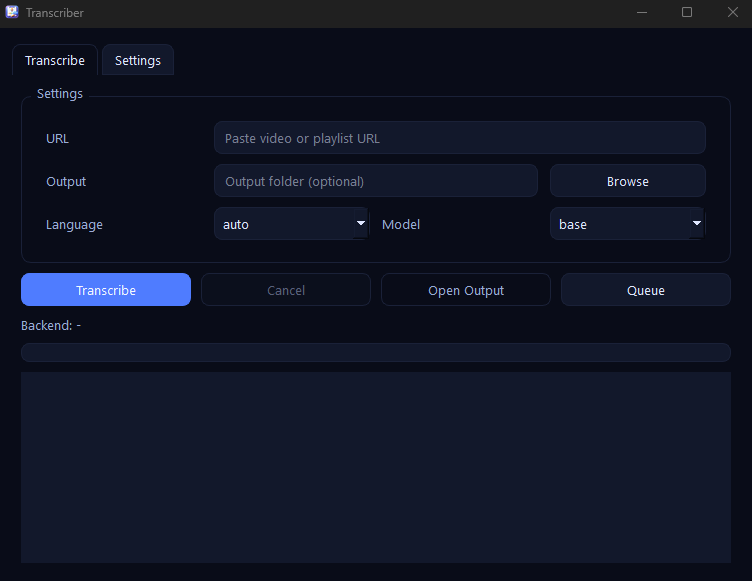
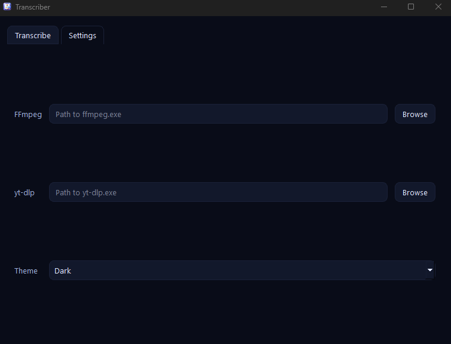

# Transcriber

Desktop app to transcribe audio from YouTube videos and playlists using OpenAI Whisper, with a simple PyQt6 UI. Downloads audio with yt-dlp, picks the best available compute backend (CUDA, DirectML, or CPU), and saves clean Markdown transcripts.

## Features

- YouTube support: single URLs and full playlists
- Automatic audio download (yt-dlp module or CLI fallback)
- Whisper models: `tiny`, `base`, `small`, `medium`
- Language selection or auto-detect
- Backend selection: CUDA (NVIDIA), DirectML (AMD/Intel), or CPU
- Theming: System / Light / Dark
- Customizable `ffmpeg`, `yt-dlp`, and output directory paths
- Progress bar and live logs
- Clean Markdown output with video metadata

## Requirements

- Python 3.10+
- ffmpeg in PATH (or set its path in-app)
- yt-dlp available (either installed as a Python module or `yt-dlp` in PATH)

The app will install missing Python packages at runtime when possible:
- PyTorch (CUDA when available, otherwise CPU)
- torch-directml (when supported; skipped on Python 3.12+)
- openai-whisper

An internet connection is required on first run to download models and dependencies.

## Quick Start (Windows)

```bash
python -m venv .venv
.venv\Scripts\activate
pip install -r requirements.txt
python main.py
```

Or double-click: `run-transcriber.bat` (uses `.venv` if present and prefers `pythonw`).

Optional (GPU / CUDA):

```bash
# Reinstall torch packages with CUDA wheels (adjust CUDA version as needed)
pip install --upgrade --force-reinstall --no-deps \
	torch torchvision torchaudio \
	--index-url https://download.pytorch.org/whl/cu121
```

## Usage

1. Launch the app: `python main.py`.
2. In the Transcribe tab, paste a YouTube video or playlist URL.
3. Choose Language (or `auto`) and a Whisper model.
4. Click Transcribe. Watch progress and logs.
5. Use “Open Output” to jump to your transcripts folder.

### UI Preview

**Main Window:**


**Settings:**


## Settings

- ffmpeg: Path to `ffmpeg.exe` if not in PATH
- yt-dlp: Path to `yt-dlp.exe` if not in PATH (module usage is also supported)
- Output: Custom output directory (defaults to `./transcripts`)
- Theme: System / Light / Dark

## Output Format

- Files are saved as Markdown: `./transcripts/<title>.md` (or to your chosen Output directory).
- Each file includes:
	- Video Information (ID, URL, detected language, model, timestamp)
	- Full transcript text

Example structure:

```
# <Video Title>

## Video Information
- **Video ID**: abc123
- **URL**: https://youtube.com/watch?v=abc123
- **Language**: en
- **Model**: base
- **Transcribed**: 2026-01-27T12:00:00Z

## Transcript
<text>
```

## Backends and Performance

- NVIDIA: Uses CUDA when available.
- AMD/Intel: Tries DirectML (`torch-directml`) when supported; otherwise CPU.
- CPU fallback: Always available, but slower.
- Larger Whisper models are more accurate but require more memory and time.

## Troubleshooting

- Missing tools: If `ffmpeg` or `yt-dlp` aren’t found, set their paths in the Settings tab.
- DirectML on Python 3.12+: `torch-directml` is skipped; the app will use CPU if no CUDA.
- yt-dlp module vs CLI: The app prefers the Python module if installed; otherwise falls back to the `yt-dlp` executable.
- First run is slow: Models and packages may download on first use.
- Permission/antivirus prompts: Some security tools prompt on first `ffmpeg`/`yt-dlp` execution.

## Notes

- Temporary audio is stored under `./data` and cleaned automatically after transcription.

